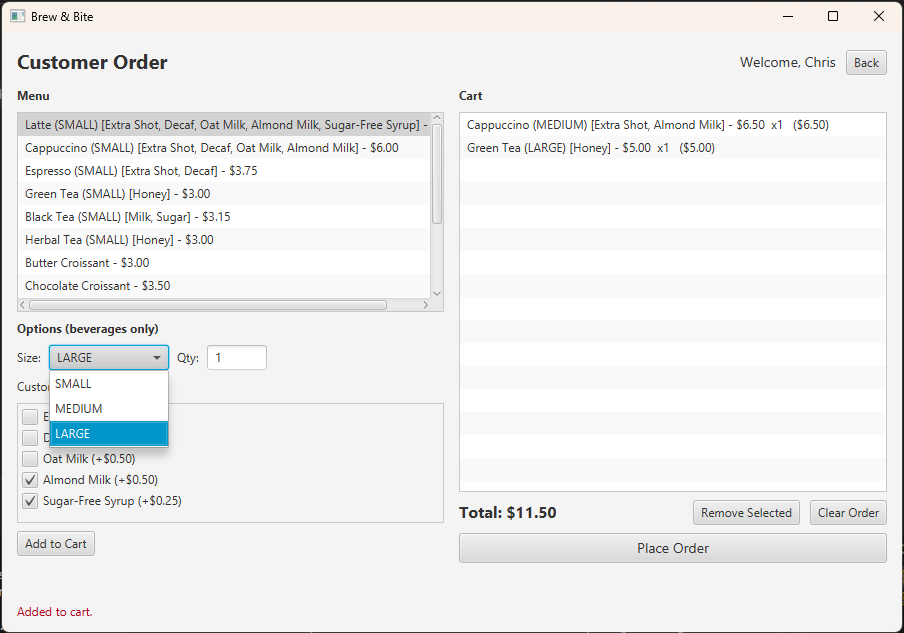
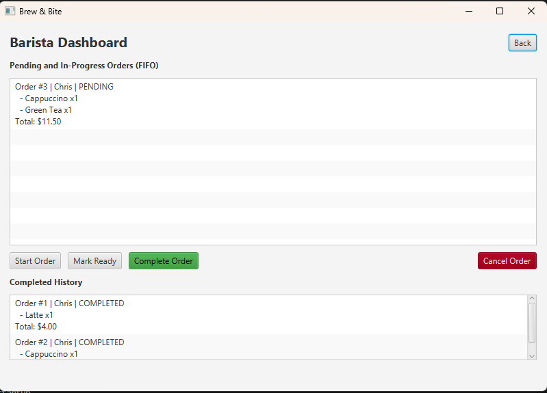
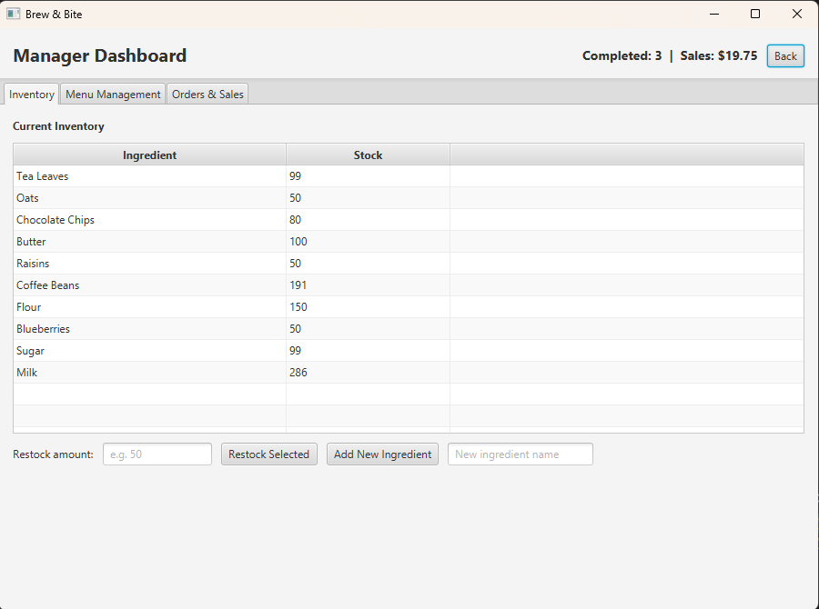
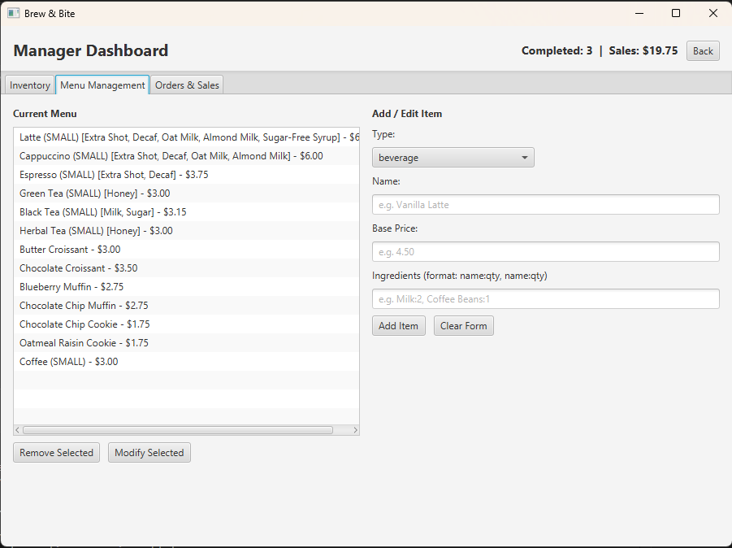

# Brew & Bite Cafe System

A JavaFX application for ICS 372 (Object-Oriented Design and Implementation)
that simulates a small cafe with three user roles: **Customer**, **Barista**,
and **Manager**.



## Team Members
- Chris Nhul
- Garvin Yau
- Salman Ahmed

## Contributions

- **Chris Nhul** — Customer ordering UI and controller (size selection,
  customization checkboxes, cart management, place-order workflow). Project
  manager: instructor communication, GitHub Projects board, weekly status
  updates. Drove the design document. Reviewed pull requests across all three
  role work streams.
- **Garvin Yau** — Manager dashboard and controller (inventory management,
  restock and add-ingredient, menu management, live sales summary, TabPane
  layout). Owned the persistence layer, including the `MenuItemAdapter` for
  polymorphic JSON.
- **Salman Ahmed** — Barista dashboard and controller (active/history split,
  four-button status workflow, FIFO queue). Role selection and login flows.
  Core domain model (`Order`, `OrderItem`, `MenuItem`, `Beverage`, `Pastry`)
  and the `MenuItemFactory` implementation. Maven build and executable JAR
  configuration.

All three members contributed to design discussions, code review, testing, and
final documentation.

## Tech Stack
- Java 21
- JavaFX 21
- Gson 2.11 (JSON serialization/deserialization)
- Maven

## Architecture & Patterns
- **MVC** — clear separation of model (`com.brewbite.model`),
  view (FXML files under `resources/com/brewbite/view`), and
  controller (`com.brewbite.controller`).
- **Facade** — `CafeSystem` is the single entry point used by all controllers.
- **Singleton** — `CafeSystem.getInstance()`.
- **Factory Method** — `MenuItemFactory` builds beverages and pastries.
- **Observer** — `OrderManager`, `InventoryManager`, and `MenuManager` notify
  the UI controllers when state changes.

## Documentation

- [Design Artifacts](docs/Brew_Bite_Design_Artifacts.pdf) — use cases, class
  diagrams, sequence diagrams, conceptual-to-software class mapping
- [Group Process Reflection](docs/Brew_Bite_Group_Process_Reflection.pdf) —
  team process, sprint cadence, conflict resolution, lessons learned

## Screens

### Barista Dashboard
Active orders sit above completed history. Both lists observe `OrderManager`,
so an order moves between them automatically when its status changes.



### Manager Dashboard
Tab-based layout. Inventory updates live as orders are placed; the header strip
carries the sales summary across all three tabs.



Menu management supports the full create-modify-remove lifecycle, with changes
persisting across restarts.



## Demo Credentials

Local demo accounts only. Authentication is simulated against local JSON —
no real credentials or personal data are stored.

| Role     | Username   | Password |
|----------|------------|----------|
| Barista  | `barista`  | `123`    |
| Manager  | `manager`  | `123`    |

Customers do not log in; they enter their name on the next screen.

## Build & Run

### Run from source (development)
```
mvn clean javafx:run
```

### Build an executable JAR
```
mvn clean package
```
This produces `target/brewbite-1.0-SNAPSHOT.jar`. Launch it with:
```
java -jar target/brewbite-1.0-SNAPSHOT.jar
```

## Data Persistence
Application data is read from JSON files in two places:

| File                       | Purpose                                              |
|----------------------------|------------------------------------------------------|
| `resources/menu.json`      | Default menu seeded on first launch                  |
| `resources/inventory.json` | Default ingredient inventory seeded on first launch  |
| `~/brewbite-data/*.json`   | Persisted runtime state (orders, inventory and menu changes) |

When the app starts, it reads `~/brewbite-data/` first and falls back to the
bundled defaults on first run. When the app exits cleanly, all state is
saved to `~/brewbite-data/`.
