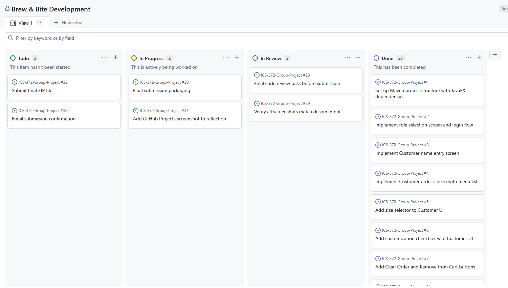

# Brew & Bite Cafe System — Group Process Reflection

**ICS 372: Object-Oriented Design and Implementation**
**Spring 2026**

---

**Team Members:**
- Chris Nhul
- Garvin Yau
- Salman Ahmed

**Submission Date:** May 5, 2026

---

## 1. Introduction

This document reflects on how our team approached, organized, and executed the Brew & Bite Cafe System project across the six-week development period. While the Design Artifacts PDF documents what we built and why, this reflection focuses on *how* we worked together — the meetings, the communication, the conflicts, the recoveries, and the lessons we are taking away from the experience.

We have tried to be honest in this writeup rather than diplomatic. There are parts of this project we are proud of, and there are parts where we know we could have done better. The point of a reflection is to learn from both kinds.

---

## 2. Team Formation and Initial Planning

Our team came together in the first week of the assignment. Chris took on the role of Project Manager, which in our context meant being the point of contact for instructor communication, owning the GitHub Projects board, and chasing down loose ends as the deadlines approached.

In our first planning conversation, we walked through the rubric line by line and broke the project into four broad work streams:

1. The customer-facing ordering experience (UI and order construction)
2. The barista-facing fulfillment experience (queue and status workflow)
3. The manager-facing administrative experience (inventory, menu, sales)
4. The shared core: domain model, persistence, facade, and observer infrastructure

We assigned the three role-specific work streams to the three of us individually, with the shared core handled jointly through a series of conversations and pull request reviews.

The decision to organize work this way was driven by the architecture itself. Because each role's controller and FXML scene were largely independent of the others (and all communicated with the system through the `CafeSystem` facade), parallel development was relatively straightforward once the facade contract was settled.

---

## 3. Communication and Coordination

### Communication Channels

We coordinated through three channels, each suited to a different kind of message:

**Asynchronous text (Discord).** This was our primary channel for day-to-day coordination — questions, status updates, links to commits, and informal design debates. Most issues were resolved in Discord without needing a meeting.

**GitHub.** Pull request reviews and Issues comments served as the formal record of design decisions. Whenever a conversation in Discord crystallized into a decision (for example, "we will route persistence through a custom Gson adapter"), we wrote it up in the corresponding Issue or PR description so it would persist.

**Synchronous calls.** We used voice or video calls for the harder conversations — initial planning, mid-sprint check-ins, and the final integration push. We did not have a fixed weekly call cadence; instead we scheduled calls when something needed to be talked through that text was not handling well.

### What Worked

Asynchronous communication worked well for status. Each of us could push code, leave a note in Discord, and pick up the next task without waiting on the others. For three people on different daily schedules, this flexibility was important.

GitHub Issues were excellent for tracking specific bugs and tasks. When the persistence layer had its polymorphic deserialization problem, we opened an issue, attached a stack trace, and linked the eventual fix commit. That kind of artifact is useful both for the project itself and as documentation of how the team thinks.

### What Did Not Work

We were slow to schedule the first synchronous call. The first two weeks were almost entirely asynchronous, and we did not realize until later that a few minor design misalignments had been quietly accumulating during that period. Specifically, we had not nailed down whether menu items would be persisted as JSON-with-type-discriminator or as separate files for beverages and pastries. The choice eventually settled itself when one of us hit the polymorphic deserialization problem, but that resolution came with a few hours of debugging and a subsequent refactor that touched several files.

In hindsight, we should have scheduled a 30-minute synchronous design review at the end of week one. Discussing the data model in real time would have caught this issue when it was still cheap to fix.

---

## 4. Project Management Tool Usage

We used GitHub Projects with a Kanban board layout to track all work for the project — not just coding tasks but also documentation, diagram creation, testing, and deliverable preparation.

### Board Structure

Our Kanban board had four columns:

- **Backlog**: Items identified but not yet started
- **In Progress**: Items currently being worked on by a team member
- **In Review**: Items where the work is complete but waiting for review or merge
- **Done**: Items that have been merged or completed

Each work item was created as a GitHub Issue and added to the board. We assigned every issue to one specific team member to ensure clear ownership. We also tagged issues with labels indicating the type of work — `feature`, `bug`, `docs`, `design`, `infra` — so we could filter the board by category when planning.

### Items Tracked

Some examples of items that lived on the board across the project:

- Implement customer order screen with size selector
- Add observer pattern to OrderManager
- Write Use Case Diagram in Mermaid
- Build executable JAR via maven-shade-plugin
- Test persistence after app restart
- Capture screenshots for design document
- Write Group Process Reflection PDF (this document)

The point of including non-coding tasks was to make sure documentation and deliverable work was not deprioritized. When a code task and a documentation task were both in the backlog, the board made the trade-off visible.

### Reflection on Project Management

Using a project management tool was a meaningful process improvement, but we want to be honest about how it played out for us. For the first part of the project, our task tracking was lightweight — a mix of pinned Discord messages, a shared text document, and inline TODO comments in the code. We consolidated this scattered tracking into a proper GitHub Projects Kanban board later in the project as the volume of work grew and the need for clearer ownership became apparent. The board's "created" timestamps therefore reflect when we migrated the items into it rather than when the work itself was first identified. Once the board was in place, accountability became significantly clearer — each task had an owner and a status, and stale items were visible at a glance. The lesson we are taking forward is straightforward: setting up a project management tool from day one is worth the small upfront cost. Doing it later, as we did, recovers most of the benefit but loses the historical record of how the project evolved.

---

## 5. Sprint Cadence and Iterative Development

We worked in roughly two-week sprints, with three sprints across the project's duration. The pattern that emerged was:

**Sprint 1 (Weeks 1–2): Foundation.** We focused on getting a minimal version of each role working end-to-end. By the end of sprint 1, a customer could pick a Latte, the barista could see it appear in their queue, and the manager could see the order in their list. The persistence layer was stubbed, the menu only had a couple of items, and customizations were not yet implemented — but the core architecture was in place and the observer pattern was working.

**Sprint 2 (Weeks 3–4): Functional Completeness.** We expanded the menu to all the rubric-required items, added size and customization handling, implemented the full status workflow, built out the manager dashboard, and integrated JSON persistence. By the end of sprint 2, every functional requirement had at least an initial implementation.

**Sprint 3 (Weeks 5–6): Polish, Bug Fixing, Documentation.** We hit our hardest bugs in this sprint — the polymorphic persistence issue, the FXML and controller mismatches that produced confusing error messages, observer subscription leaks. In parallel, we worked on the design artifacts and this reflection document. Sprint 3 also produced the executable JAR and the screenshots for the design PDF.

The choice to build something end-to-end first (rather than building each layer in isolation) paid off significantly. By the time we needed to integrate, we were not integrating — the integration had already been happening since week one. This let us spend the final sprint on quality rather than on plumbing.

---

## 6. Conflict and Resolution

A six-week project with three contributors will have disagreements, and ours did. Two stand out as worth reflecting on.

**The persistence approach.** Two of us initially favored simple JSON files (one per data type) and the third advocated for a single state file with embedded type discriminators. The conversation went on across several Discord messages and one pull request comment thread. The eventual resolution was a hybrid: separate files per data type (orders, inventory, menu) but each file using the type-discriminator approach internally for the menu and order content.

This was not a one-sided "right answer wins" outcome — both proposals had merit, and the hybrid took something useful from each. We resolved the disagreement by laying out the trade-offs explicitly (file count, atomicity, schema flexibility) and picking the option that scored best across all three. Looking back, we are glad we did not just let the loudest voice win.

**Scope and gold-plating.** At one point in sprint 2, one team member proposed adding email notifications when an order was completed. The feature was not in the rubric. The discussion that followed was a little uncomfortable — the proposer had legitimate reasons for wanting it (it would have made the system feel more "real"), but the rest of us were focused on rubric coverage and worried about scope creep. We resolved this by deferring the feature to the "Future Work" section of the design document rather than implementing it. The proposer accepted the deferral but flagged that future projects should explicitly discuss what's "in" and "out" at sprint kickoff to avoid this kind of mid-sprint discussion.

In both cases, the resolution worked because we treated the disagreement as a problem to solve together rather than a contest to win. We did not always agree, but we agreed on how to disagree.

---

## 7. Individual Contributions

Below is a summary of what each team member primarily contributed, organized to give a process-focused view rather than just a feature list. (Note: this section should be reviewed and adjusted by the team to reflect actual responsibility distribution before submission.)

### Chris Nhul

**Primary technical work:** Customer ordering UI and controller (size selection, customization checkboxes, cart management, place-order workflow). The customer screen ended up being the most feature-rich UI in the application, and Chris owned its evolution from initial sketch to final implementation.

**Process work:** Project Manager role — instructor communication, GitHub Projects board ownership, instructor weekly status updates. Drove the design document writing, particularly the conceptual class mapping, applied OO principles, and the reflective sections.

**Reviews:** Reviewed pull requests across all three role-specific work streams to maintain consistency in the code style and FXML conventions.

### Garvin Yau

**Primary technical work:** Manager dashboard and controller — including the inventory management, restock and add-ingredient features, the menu management tab with full add/modify/remove, the live sales summary, and the TabPane layout. Owned the persistence layer including the `MenuItemAdapter` for polymorphic JSON.

**Process work:** Drove the most challenging debugging session of the project (polymorphic persistence) and documented the eventual solution for the team. Wrote initial draft of several diagrams in the design document.

**Reviews:** Reviewed pull requests touching the persistence layer and the facade. Caught several edge cases during code review that would have surfaced as bugs later.

### Salman Ahmed

**Primary technical work:** Barista dashboard and controller — including the active/history split, the four-button status workflow, and the FIFO queue display. Implemented the role selection and login flows. Owned the core domain model classes (`Order`, `OrderItem`, `MenuItem`, `Beverage`, `Pastry`) and the `MenuItemFactory` factory pattern implementation.

**Process work:** Built and validated the initial Maven build configuration including the executable JAR setup. Drove the Use Case Diagram and the Sequence Diagrams in the design document.

**Reviews:** Reviewed pull requests touching the domain model and the factory. Helped maintain consistency in how observer registrations were handled across the three controllers.

All three of us contributed to design discussions, code reviews, testing, the executable JAR validation, and final documentation across the full project duration.

---

## 8. What Went Well

**The architecture stayed clean.** This is the result we are most proud of. Despite three people working in parallel and the inevitable tweaks across the project's lifetime, the layering held up. The controllers stayed thin. The facade kept its scope. The observer pattern worked exactly as the textbook describes. We can look at the code today and see the principles we were trying to apply, which is not always the case in time-pressured projects.

**Project management discipline.** Having every task on the GitHub Projects board, with a clear owner and status, kept us coordinated without requiring constant communication. We never lost a task to "I thought you were doing that."

**Code review culture.** Every meaningful change went through a pull request, and every pull request had at least one review before merging. This was not enforced by anyone — it just became how we worked. The result was that code quality stayed high throughout, and several bugs were caught at review time before they shipped.

**Iterative development.** Building end-to-end early, even in stub form, meant integration was never a "big bang" event. Each sprint added depth to a system that was already running, rather than gluing together pieces that had been developed in isolation.

---

## 9. What We Would Do Differently

**Earlier synchronous design discussions.** Our biggest single takeaway. The first synchronous call should have happened by end of week one. Async-only communication is great for execution but slow for early-stage design alignment. We lost a few hours to the polymorphic persistence misalignment that an early call would have prevented.

**More upfront contract definition.** When we split work along role lines, we did not write down the exact `CafeSystem` API that the controllers would call. We let it emerge organically. This worked, but it produced some retrofit moments where one controller needed a method another controller had implemented inline. A 30-minute exercise to draft the facade interface up front would have avoided this.

**Earlier testing.** We did not write enough automated tests. The application has been thoroughly manually tested, and that has surfaced and fixed real bugs, but unit tests for the domain model and managers would have given us much more confidence during the final sprint refactors. This is the single biggest gap between our process and the process we would use on a real-world project.

**More proactive documentation.** We wrote most of the design document at the end. It would have been better to keep design notes as we went — not the polished final versions, but small markdown files in `docs/` that captured the reasoning behind each major decision. By the end of the project, some of our early decision rationales had partially evaporated and we had to reconstruct them.

---

## 10. Learning Reflections from the Team

Each of us took something specific away from this project beyond the technical content.

**On collaboration.** Working with two other people on a unified codebase teaches things that solo coursework does not — how to write code that someone else will read, how to give and receive critique through a pull request, how to disagree productively, how to keep your part working without breaking everyone else's. These are skills that carry directly into industry.

**On design as practice.** It is one thing to read about the Observer pattern in a textbook and another to build a system where Observer is doing real work and you can see, in real time, why it is the right answer. The textbook patterns became something more than abstract concepts during this project.

**On scope and pacing.** The project's scope felt enormous at the start of week one and entirely manageable by the end. The difference was not that we became faster coders — it was that we got better at breaking work down, sequencing it, and trusting the process to carry us through the breakdown. We learned to recognize the difference between a task that is genuinely hard and a task that just looks hard because we have not split it up yet.

**On reading the rubric carefully.** Spending time at the beginning to walk through the rubric line by line and tag each requirement to a planned work item paid off throughout the project. We rarely had moments of "wait, did we forget something?" because the rubric had been broken down into trackable work from day one. This is a habit we are leaving the course with that we did not have when we started.

---

## 11. Closing Thoughts

The Brew & Bite Cafe System is a finished, working, polished application built deliberately on the principles the course covered. We did not just check boxes against the rubric; we applied the patterns thoughtfully, reflected on our choices, and delivered something we would not be embarrassed to show to a future employer.

If we had to point to one thing that made this work, it would be the team itself. Everyone showed up, did their part, gave honest feedback, and accepted feedback in turn. Process tools help, but no process tool produces a good project on its own. Three people who respect each other's time and contribution can do real work together, and that is what we did.

We finish this project with a stronger sense of what good software development looks like in practice — and equally importantly, with a stronger sense of what good *teamwork* on software development looks like. Both are skills that will travel with us long after this course is over.
