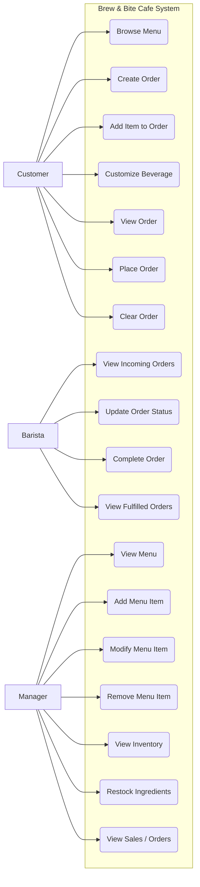
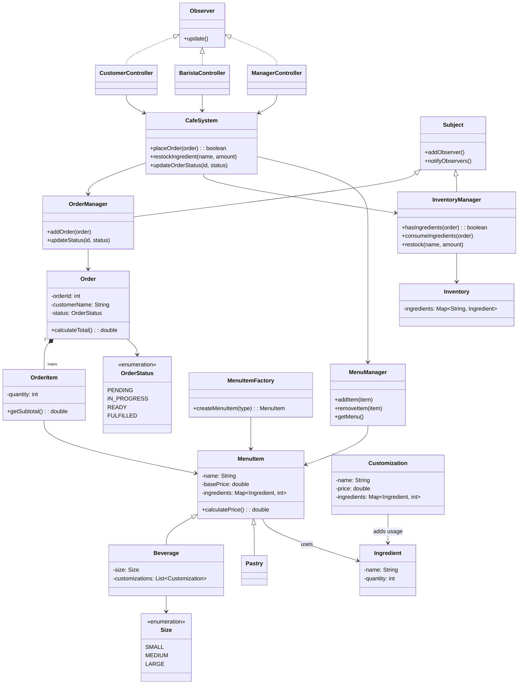
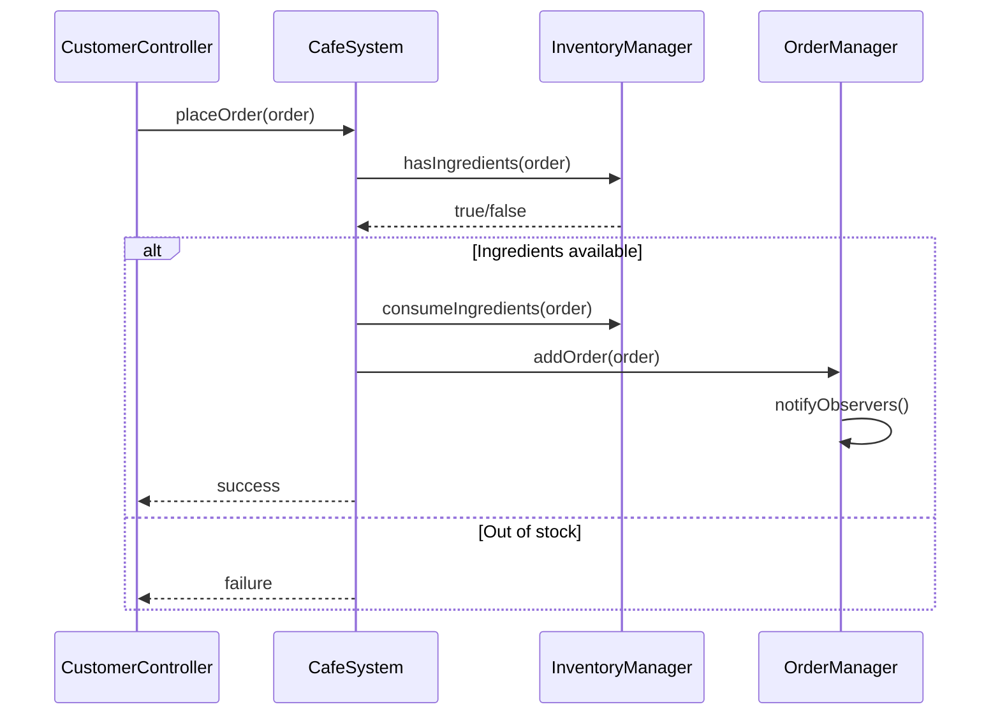
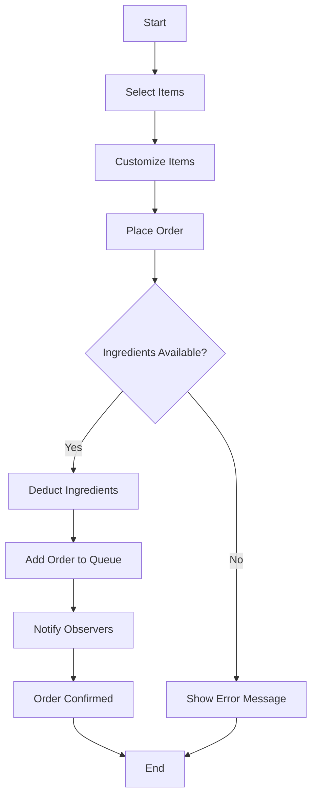
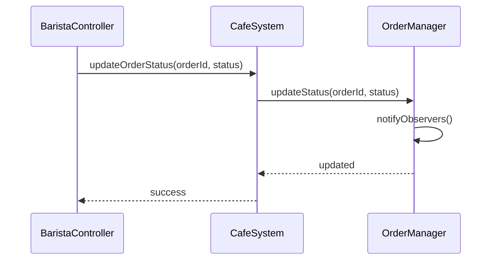
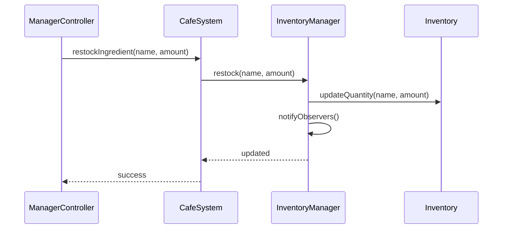

# Design Artifacts: Brew & Bite Cafe
### Use Case Diagram

---
### Wireframes

**Customer Order Dashboard**

---
**Barista Dashboard**

---
**Manager Dashboard**

---

### Conceptual Classes to Software Classes:

**Key Conceptual Classes:**

|Class Name|How it Translates into Software Classes|Primary Responsibility|
|---|---|---|
|`MenuItem`|Implemented as an abstract class, with subclasses like `Beverage`, and `Pastry`|Defines common attributes and behavior for all menu items|
|`Beverage`|Subclass of `MenuItem`. Seperated from `MenuItem` because of additional customizations.|Represents customizable drinks. Handles pricing based on size add-ons|
|`Pastry`|Subclass of `MenuItem`. Seperated from `MenuItem` because of the difference in behavior compared to Beverage.|Represents fixed price pastry items.|
|`Order`|Implemented directly as `Order`.|Represents a complete order including customer name, list of items, total price, and status.|
|`OrderItem`|Implemented directly as `OrderItem`. Seperated from `Order` which allows for multiple items, quantity tracking, and flexible pricing.|Represents a single item in an order including quantity and subtotal.|
|`OrderStatus`|Implemented as an `enum`.|Represents the current state of an order in the workflow.|
|`Ingredient`|Implemented as data class. Keeps data seperate from management logic.|Stores information about an ingredient|
|`Inventory`|Implemented as a class that manages ingredient stock.|Maintains current stock levels of all ingredients.|
|`InventoryManager`|Implemented as a seperate service class. Seperate from `Inventory` so it follows the Single Responsibility Principle and keeps logic out of data classes.|Handles inventory operations like restocking and checking availability.|
|`OrderManager`|Replaces the concept of the Order Queue and merges queue and logic into one class.|Manages all order operations like adding new orders and updating status of an order.|
|`MenuManager`|Implemented as a management class. Merges menu catalog and logic into one class.|Manages all available menu item operations like adding an item, removing an item, or updating an item.|
|`Customization`|Implemented directly as `Customization`. Works with `Beverage` via composition.|Represents optional add-ons that modify a beverage's price and ingredient usage.|
|`Size`|Implemented as an `enum`.|Represents size options for beverages and influences pricing.|
|`MenuItemFactory`|Implemented as a Factory Pattern which encapsulates object creation.|Creates the apppropriate `MenuItem` objects based on input data.|
|`CafeSystem`|Implemented as a Facade Pattern which simplifies controller interaction.|Provides an interface for system operations like placing orders and managing inventory.
|`Observer` and `Subject`|Implemented directly as `Observer` and `Subject` for Manager and Barista.|Allows for automatic updates of UI componenets when system state changes.|

### Omitted Classes:
**Individual Menu Items**
* Individual menu items like `Latte`, `Muffin`, `Tea`, would create too many class as our menu grows. Replacing this with the type of item like `Beverage` and `Pastry` makes it more scalable.

**User Classes**
* User classes like `Barista`, `Customer`, `Manager` is omitted because no persistent state is needed. Instead, we replace it with role-based logic in controllers.

---

### High-Level UML Class Diagram

---

### Delegating Responsibilities

**Customer Places an Order**

* This sequence diagram shows how a customer order is processed through the system. The controller delegates the request to the Facade `CafeSystem`. `CafeSystem` then manages the interactions with `InventoryManager` and `OrderManager`. `InventoryManager` validates if there is sufficient stock of ingredients and deducts ingredients based on the order. The `OrderManager` stores the order and notifies the observers, ensuring that all UI components reflect the addition. This design uses the Facade pattern for simplified interaction and the Observer pattern for real-time updates.

**Activity Diagram**

* This activity diagram shows the workflow and decision points within the process of placing an order.

---

**Barista Updates Order Status**

* This sequence diagram shows how a barista updates an order status. The controller or barista sends the request to the Facade `CafeSystem`. `CafeSystem` then delegates the update to `OrderManager`. `OrderManager` updates the order state and notifies observers, ensuring all UI components reflect the update. This design uses the observer pattern and shows a clear seperation of concerns between UI and business logic.

---

**Manager Restocks Inventory**

* This sequence diagram shows how a manager restocks the inventory. The controller or manager sends the request to the Facade `CafeSystem`. `CafeSystem` then delegates the request to `InventoryManager`. `InventoryManager` updates the inventory and notifies observers ensuring all UI components reflect the update. This design uses the Observer pattern and shows a clear seperation of concerns between UI and business logic.

---

### Application Layers & MVC Implementation

**The System is designed using a layered architecture to seperate concerns. It is divided into three layers:**

**UI Layer**
* This layer is responsible for all user interaction and interface rendering. It captures user input, displays system data and delegates user interaction to the system. It is implemented using JavaFX components and corresponding controller classes. 

**Business Logic / Domain Model Layer**
* This layer contains data representation and the core functionality of the system. It represents real world entities, enforces business rules, and manages operations across subsystems. It defines the system state and the rules that influence its behavior.

**Persistence Layer**
* This layer handles data storage and retrieval using JSON files. It loads the initial system state, saves system state, and ensures data persistence across runs.

**Model**
* Model represents the system's data and business logic.
* It includes `MenuItem`, `Order`, `Inventory`, `OrderManager`, `InventoryManager`, `MenuManager`, `CafeSystem`, `MenuItemFactory` and observer interfaces.
* It maintains system state, perform business operations, and notifies observers of change.

**View**
* View consists of JavaFX user interface components.
* It includes UI layouts and visual components.
* It displays data to users and reflects real-time updates from the Model.

**Controller** 
* Controller acts as the intermediary between View and Model.
* It includes `CustomerController`, `BaristaController`, and `ManagerController`.
* It handles user input, invokes operations on `CafeSystem`, and updates the View based on responses.

**Justification**
* The layering and MVC was designed to ensure high cohesion within components and low coupling between them. 
  * High Cohesion:
    * Controllers only handle user input.
    * Managers only handle business logic.
    * Domain classes only represents data.
    * Persistence only handle data storage.
  * Low Coupling:
    * Controllers only interact with the `CafeSystem` Facade.
    * Controllers don't directly access managers or domain classes.
    * Domain classes are independent of UI and persistence logic.
    * Use of the Facade pattern reduces coupling by providing a single entry point into the system, hides internal complexity of managers, and prevents controllers from interacting with multiple subsystems.
    * Use of the Observer pattern reduces coupling further by allowing UI components to react to changes without direct dependencies.

### Applied Object-Oriented Principles & Patterns

#### Observer Pattern

**Where it is used**
* Used in `OrderManager`, `InventoryManager`, and Controllers / UI Components.

**How it is applied**
* The Observer pattern is used to allow real-time updates between system and UI.
* Whenever a new order is placed, order status changes, or inventory is updated, `OrderManager` or `InventoryManager` notifies all registered observers.

**Benefits**
* This pattern reduces coupling between business logic and UI. It ensures that multiple views stays synchronized with system state changes automatically.

**Example**
* `OrderManager.notifyObservers()` triggers updates in Barista and Manager views. 

#### Factory Pattern

**Where it is used**
* Used in `MenuItemFactory`

**How it is applied**
* The Factory pattern is used to centralize object creation for menu items.
* Instead of needing multiple `new Beverage()` or `new Pastry()` statements, the system uses `MenuItemFactory.createMenuItem(type)` to create objects for menu items. 

**Benefits**
* This pattern encapsulates object creation logic and suppots the Open/Closed Principle, allowing for new item types to be added without modifying existing code.

**Example** 
* `MenuItemFactory.createMenuItem(type)` creates objects based on input data.

#### Facade Pattern

**Where it is used**
* Used in `CafeSystem`

**How it is applied**
* The Facade pattern is used to provide a single entry point for system operations like placing orders, updating order status, and restocking inventory.
* Controllers only interact with `CafeSystem`, which delegates tasks to managers.

**Benefits**
* This pattern reduces system complexity for controllers and enforces low coupling between UI and business logic.

**Example**
* `cafeSystem.placeOrder(order)` 

#### Polymorphism / Strategy Pattern

**Where it is used**
* Used in `MenuItem` as a hierchy to `Beverage` and `Pastry`, `Customization` as well as in pricing logic via overridden methods.

**How it is applied**
* Different menu items calculate prices differently.
  * Beverage has different sizes and customizations.
  * Pastry has fixed pricing.
* This is achieved by using method overriding and composition.

**Benefits**
* This pattern allows for flexible pricing while keeping a shared interface for all menu items.

#### Single Responsibility Principle

* The system is designed so that each class has one clear responsibility.
  * `Order` only stores order data and does not handle inventory or UI logic.
  * `InventoryManager`  only handles stock validation and updates and does not manage orders or UI.
  * `OrderManager` only handles order lifecycle and does not calculate pricing. 
  * `CafeSystem` only manages business operations and does not implement detailed business operations.

#### High Cohesion

* The system is designed so that each class only contains related responsibilities.
  * `MenuItem` only deals with menu related data and behavior.
  * `Inventory` only manages ingredient storage.
  * `OrderManager` only manages orders.

#### Inheritance

* The system uses inheritance to model hierarchical relationships.
  * `MenuItem` is a parent to both `Beverage` and `Pastry`.

#### Composition

* The system uses composition to build complex objects from simpler ones.
  * `Order` contains multiple `OrderItem` objects.
  * `OrderItem` references a `MenuItem`.
  * `Beverage` contains `Customization` objects.
  * `Inventory` contains multiple `Ingredient` objects.