# Brew & Bite Cafe System — Design Artifacts

**ICS 372: Object-Oriented Design and Implementation**
**Spring 2026**

---

**Team Members:**
- Chris Nhul
- Garvin Yau
- Salman Ahmed

**Submission Date:** May 5, 2026

---

## 1. Introduction

Brew & Bite is a JavaFX-based cafe management application that simulates the day-to-day workflow of a small coffee shop. The system supports three distinct user roles — Customer, Barista, and Manager — and coordinates ordering, fulfillment, inventory tracking, and menu management through a single shared application state.

When we approached this project, our goal was not just to satisfy each functional requirement in isolation but to build something that genuinely behaves like a real cafe system would. That meant taking the time to think through how a customer's order should flow into a barista's queue, how inventory should respond to that order in real time, and how a manager should be able to step in and adjust either side without breaking anything in the middle. The patterns and principles covered in Chapters 5 and 6 of the textbook gave us a vocabulary for these design decisions, and most of the choices documented in this report trace back to that material.

This document walks through the design of the system from the outside in: starting with the use cases that define what the system does, then moving into the conceptual model, then the implemented software classes, and finally the architectural patterns and design principles that hold it all together.

---

## 2. Use Case Diagram

The diagram below summarizes the primary actor-system interactions. Each role has access to its own functionality and cannot perform actions outside its scope (e.g., a customer cannot fulfill an order, and a barista cannot manage inventory).

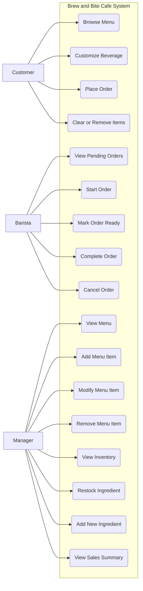

A small detail worth noting: the manager's "View Sales Summary" use case is satisfied by a live-updating label in the manager's header rather than a separate dedicated screen. We made this choice because sales totals are most useful when they are always visible, not when they require a deliberate action to view.

---

## 3. Wireframes and Implemented UI

Our team initially sketched low-fidelity wireframes during the planning phase to align on layout. As the implementation progressed, several details shifted in response to what felt natural to use during testing — for example, our original customer screen did not include a dedicated "Clear Order" button, but we added one once it became clear how often a tester wanted to start over without navigating back. Rather than retain the early sketches, we are presenting screenshots of the actual delivered interface, since these are both more accurate and more useful for review.

### 3.1 Role Selection

The application's launch screen presents the three role choices. Customers proceed without authentication, while baristas and managers continue to a login screen.

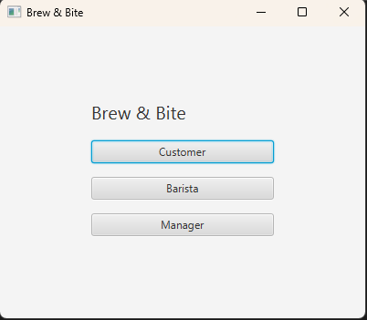

### 3.2 Customer Name Entry

When a customer is selected, they are prompted for a name. This name is later attached to their order so the barista can identify whose drink they are preparing.

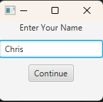

### 3.3 Customer Order Screen

This is the most feature-rich screen in the application. The left panel lists every available menu item; selecting a beverage activates the size dropdown and reveals the relevant customization checkboxes. The right panel shows the current cart with item subtotals and a running order total.

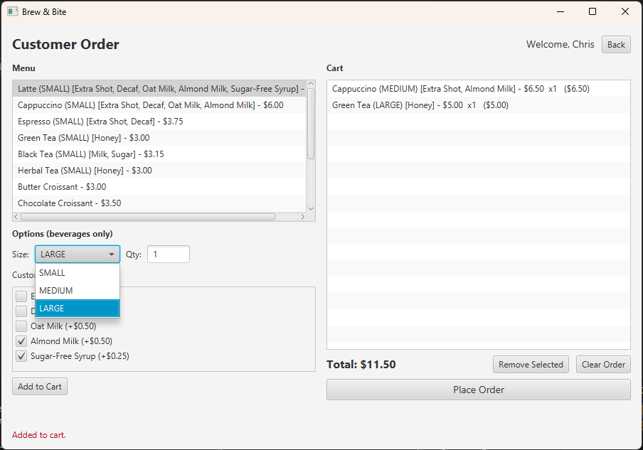

The interaction we wanted to reward here was exploration — a customer who wants to compare a Latte with Oat Milk against a Latte with Almond Milk should be able to add both to their cart, see the price difference clearly, and then commit to one before placing the order. The "Remove Selected" and "Clear Order" buttons exist so this exploration never feels permanent.

### 3.4 Barista Dashboard

The barista screen shows two stacked lists: active orders at the top, completed and cancelled orders at the bottom. The four action buttons in the middle apply the appropriate state transition to whichever active order is selected.

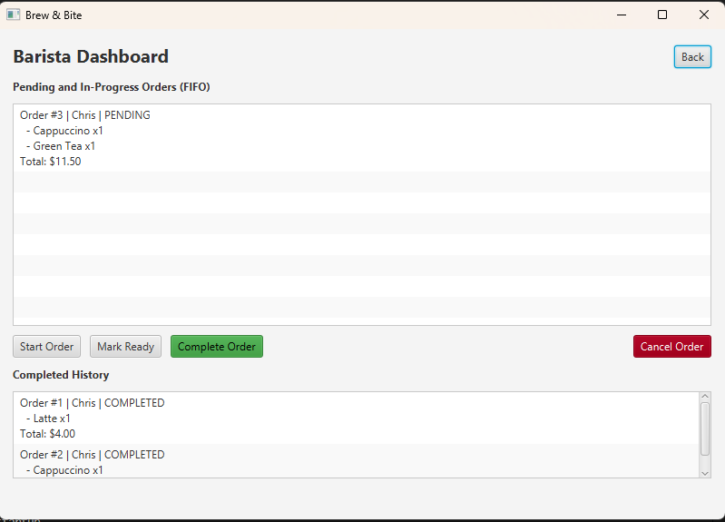

We deliberately separated active orders from history so that a barista who is busy never has to scan past completed orders to find what they should be working on. Because both lists are observers of the underlying `OrderManager`, an order moves between them automatically when its status changes.

### 3.5 Manager Dashboard — Inventory Tab

The manager dashboard uses a tab-based layout. The Inventory tab shows the current stock of every ingredient, supports restocking and adding new ingredients, and updates live as orders are placed.

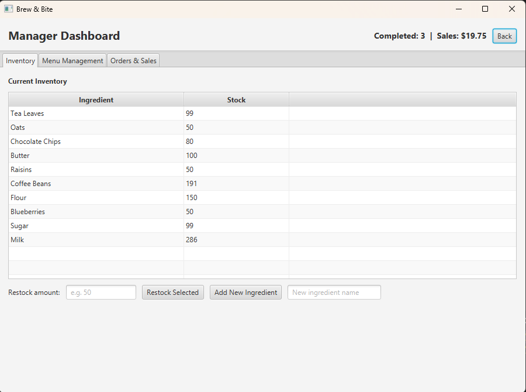

The header strip carries the live sales summary across all three tabs. We chose this placement so the sales total is always visible regardless of which tab the manager is currently looking at.

### 3.6 Manager Dashboard — Menu Management Tab

The Menu Management tab supports the full create-modify-remove lifecycle for menu items. Selecting an existing item allows the manager to edit its fields and apply the change in place, while leaving the form blank and clicking Add Item creates a new entry.

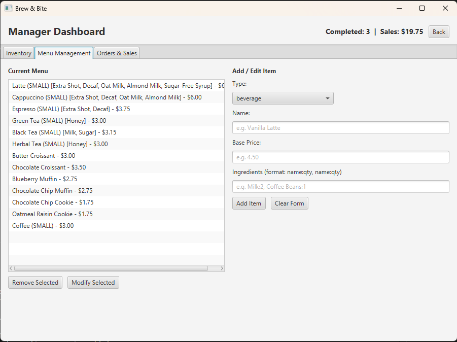

The custom "Coffee" item visible at the bottom of the menu list demonstrates that newly-added items persist correctly across application restarts — an important verification, because polymorphic persistence of menu items required custom handling that we discuss in Section 8.

---

## 4. Conceptual Classes to Software Classes

The conceptual class identification process started by extracting nouns from our use case descriptions and the project requirements. We then judged each noun on whether it represented a thing the system needed to track and reason about (a class), a property of something else (an attribute), or a real-world concept that did not need an in-system representation (eliminated).

The table below summarizes how the resulting conceptual classes map to the software classes we ultimately implemented.

| Conceptual Class | Software Class(es) | Primary Responsibility |
|---|---|---|
| MenuItem | `MenuItem` (abstract) | Defines the shared interface (name, base price, ingredient consumption) for anything that can be ordered. |
| Beverage | `Beverage extends MenuItem` | Adds size and customization behavior; overrides price calculation to account for both. |
| Pastry | `Pastry extends MenuItem` | Fixed-price menu item with optional variation field. |
| Customization | `Customization` | Data class representing an optional add-on (name, price surcharge, additional ingredient cost). |
| Size | `Size` (enum) | Constrains beverage sizing to SMALL, MEDIUM, LARGE. |
| Order | `Order` | Tracks customer name, line items, total price, and order status. |
| OrderItem | `OrderItem` | Pairs a MenuItem with a quantity; computes the subtotal for that line. |
| OrderStatus | `OrderStatus` (enum) | The lifecycle states an order can be in. |
| Ingredient | `Ingredient` | Data class for a named ingredient and its current stock count. |
| Inventory | `Inventory` | Holds the map of ingredients and exposes simple add/reduce operations. |
| InventoryManager | `InventoryManager` | Service class that mediates inventory access for orders and observers. |
| OrderManager | `OrderManager` | Service class that owns the order list and handles status updates. |
| MenuManager | `MenuManager` | Service class that owns the menu and handles add/remove/modify. |
| MenuItemFactory | `MenuItemFactory` | Factory Method implementation for creating MenuItem subtypes. |
| MenuItemAdapter | `MenuItemAdapter` | Custom Gson type adapter that handles polymorphic serialization of MenuItem subclasses. |
| CafeSystem | `CafeSystem` | Facade and Singleton; the single entry point controllers use to coordinate the three managers. |

### Classes That Were Merged or Omitted

A few conceptual classes from our early sketches did not survive into the final design.

**Individual menu items** (Latte, Cappuccino, Muffin, etc.) — In an early draft we considered a class hierarchy where each specific drink and pastry had its own subclass. We rejected this because each new menu item would require new code, and the parent-class pricing logic was already general enough to accommodate any beverage or pastry by reading data rather than by branching on type. Replacing the per-drink subclass approach with `Beverage` and `Pastry` parent classes plus JSON-driven instantiation kept the system extensible without code changes.

**User classes** (Customer, Barista, Manager) — We chose not to model these as persistent classes because the application has no concept of a customer history or a logged-in user beyond the current session. Roles are enforced through which scenes the user can navigate to, and the customer name is held briefly in `CafeSystem` for the duration of an order. If the system ever needed to track customers between sessions or distinguish between different baristas on shift, these classes would re-enter the design.

**Receipt** — Initially identified as a noun in our use cases, but we eliminated it because nothing in the application needs to maintain a separate receipt object. The information that would appear on a receipt — items, prices, total — is already fully expressed by an `Order` instance, so introducing a `Receipt` class would have duplicated state.

---

## 5. High-Level UML Class Diagram

The diagram below shows the major classes and their relationships, organized so the dependencies flow from the outer UI layer inward toward the core domain model.

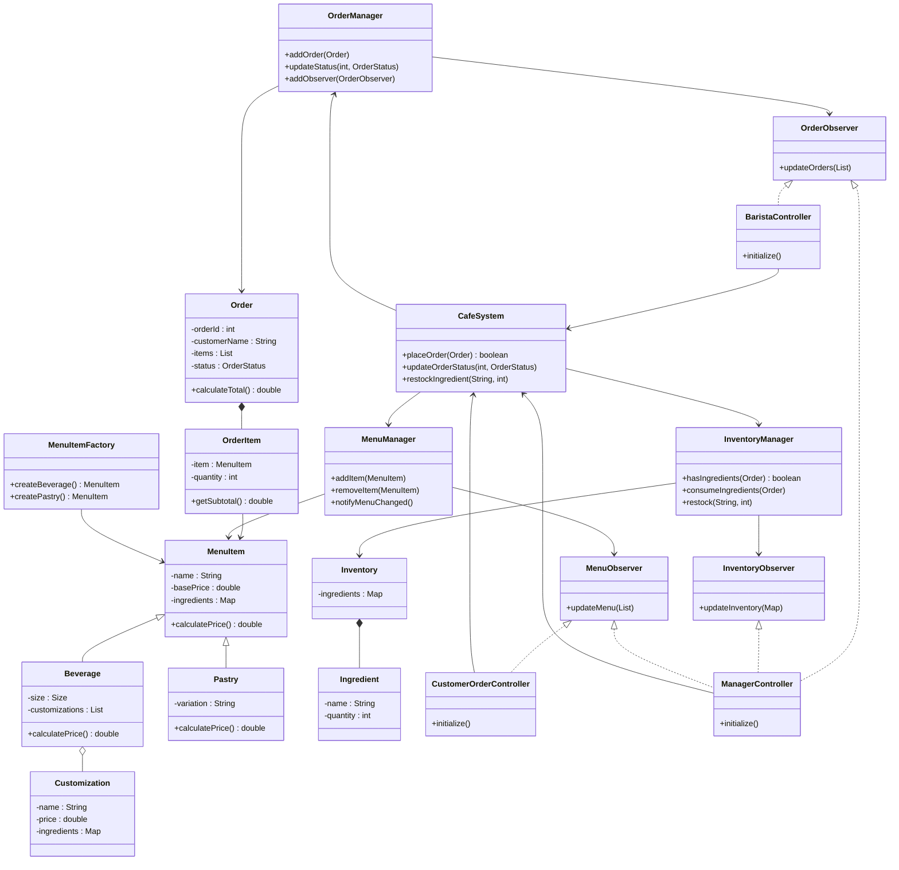

The diagram emphasizes a few things we wanted to be deliberate about:

The controllers depend only on `CafeSystem` (the facade) and on the observer interfaces. They never reach directly into `OrderManager`, `InventoryManager`, or `Inventory`. This was intentional and is the main reason we use the Facade pattern — controllers do not need to know how the managers coordinate with each other.

Composition appears explicitly: an `Order` *contains* `OrderItem`s, an `OrderItem` *references* a `MenuItem`, a `Beverage` *contains* `Customization`s, and an `Inventory` *contains* `Ingredient`s. None of these inner objects make sense outside their containers.

Inheritance is used only where the textbook's "is-a" test holds clearly. A `Beverage` is a `MenuItem`; a `Pastry` is a `MenuItem`. We resisted the temptation to inherit elsewhere — for instance, `OrderManager` and `InventoryManager` share the observer-registration boilerplate but do not inherit from a common parent, because we did not feel the abstraction was strong enough to justify the coupling.

---

## 6. Delegating Responsibilities — Sequence Diagrams

We chose three significant use cases to illustrate how responsibilities are distributed among the software classes: a customer placing an order, a barista changing an order's status, and a manager restocking inventory. Each diagram focuses on the core business logic and abstracts away purely UI concerns where they would not add insight.

### 6.1 Customer Places an Order

This is the most involved flow in the system. It touches inventory verification, ingredient deduction, order registration, and observer notification — and demonstrates how the Facade coordinates the three managers without exposing them to the controller.

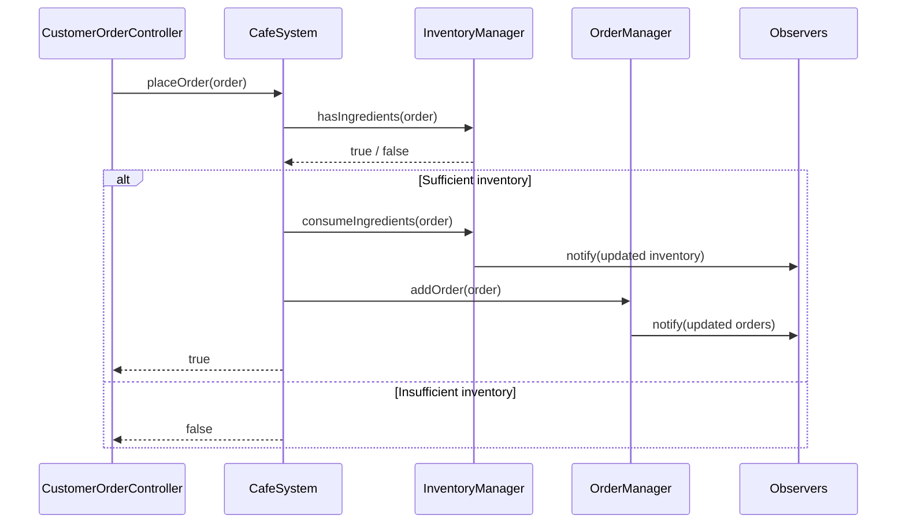

The branch is important: if inventory cannot support the order, no state changes occur. This was a deliberate choice — we did not want a half-completed order where some ingredients were deducted before the system noticed it could not fulfill the rest. The check happens up front, atomically.

A subtlety not captured in the high-level diagram is that the controller separately deducts ingredients used by customizations after the facade returns success. This is because customization ingredient cost is tracked at the customization level (each `Customization` carries its own ingredient map) rather than rolled up into the parent `Beverage`. We considered moving customization deduction inside `CafeSystem.placeOrder()` for symmetry, but the controller already needs to verify customization-level inventory, so handling both checks and deductions there kept the related logic together.

### 6.2 Barista Changes Order Status

This is the simplest of the three flows, but it illustrates the Observer pattern in its purest form: the barista performs one action, and three different views (the barista's own active list, the barista's history list, and the manager's order list) all update in response.

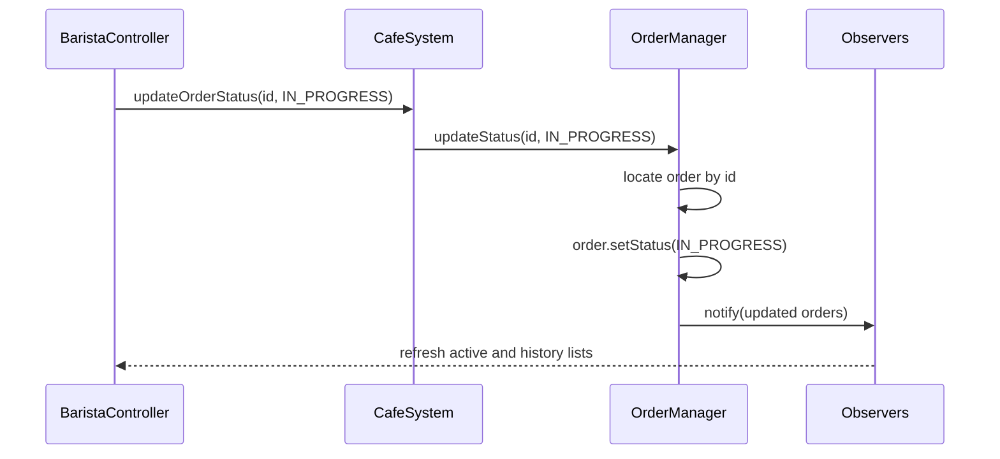

Each observer is responsible for deciding what to do with the updated list. The barista's controller filters into active versus history; the manager's controller shows everything. The `OrderManager` does not know or care about this — it just fires the event.

### 6.3 Manager Restocks Inventory

The manager's restock flow is the shortest of the three but provides another concrete example of the Observer pattern triggering across views.

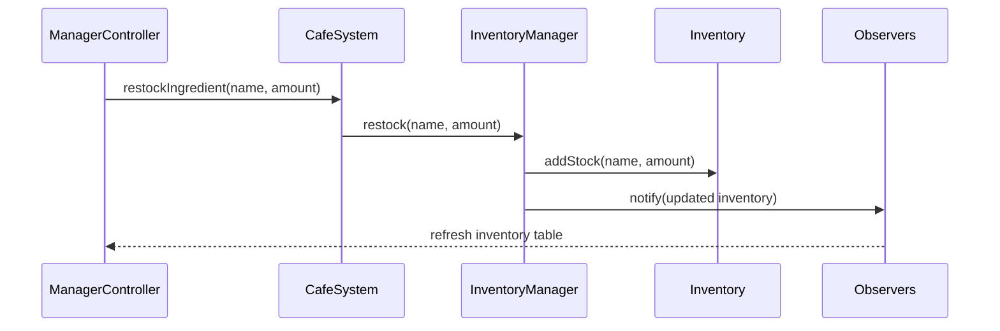

Although only the manager view is currently registered as an inventory observer, the system is structured so that any future view (for example, a low-stock alert badge) could simply implement `InventoryObserver` and subscribe without any changes to `InventoryManager`.

### 6.4 Activity Diagram — Customer Order Placement

The diagram below shows the same customer order flow as Section 6.1 but emphasizes the decision points and workflow rather than the message sequence.

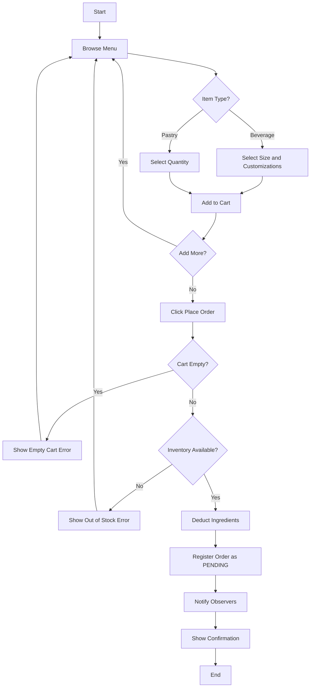

We include this activity diagram because the order placement path has more decision points than the other use cases, and the visual treatment makes the failure paths (empty cart, insufficient inventory) explicit.

---

## 7. Application Layers and MVC Implementation

We organized the application into three distinct layers, each with a clear responsibility:

**Presentation Layer (View + Controller).** This layer captures user input and renders state. It consists of the FXML files under `src/main/resources/com/brewbite/view/` and the corresponding controller classes in `com.brewbite.controller`. The FXML files contain only structural markup and no business logic. Controllers translate user gestures (button clicks, list selections, text entry) into method calls on the facade.

**Business Logic / Domain Layer.** This is the heart of the system: domain classes (`MenuItem`, `Order`, `Inventory`, `Customization`, etc.), service classes that manage their lifecycle (`OrderManager`, `InventoryManager`, `MenuManager`), the `CafeSystem` facade that coordinates them, and the `MenuItemFactory` that creates the polymorphic types. This layer has no knowledge of JavaFX or of how data is persisted.

**Persistence Layer.** Responsible for reading the bundled JSON defaults on first run and saving / loading user state to and from the user-home directory. Implemented by `DataLoader`, `DataStore`, and the `MenuItemAdapter`.

The MVC pattern overlays cleanly onto these layers:

- **Model**: every class in the domain layer plus the persistence helpers. The model is what knows about menu items, orders, and inventory.
- **View**: the FXML files. They describe the layout and visual elements but contain no behavior.
- **Controller**: `RoleSelectionController`, `LoginController`, `CustomerNameController`, `CustomerOrderController`, `BaristaController`, and `ManagerController`. Each controller is bound to one FXML file and one user role.

### Justification

The decision to layer the application this way was driven by two textbook principles in particular: **high cohesion** within each layer, and **low coupling** between layers.

Each controller has one responsibility — translating user actions for one screen. None of them know how orders are persisted, how the inventory enforces non-negative quantities, or how customizations contribute to the price calculation. This kept each controller small enough that all of its behavior fits on one screen of source code, which we found significantly improved our ability to make changes without introducing regressions.

The `CafeSystem` facade is the only point through which controllers interact with the domain. This is the single most impactful coupling decision in the whole project. Earlier in development, the `CustomerOrderController` directly held references to `OrderManager` and `InventoryManager`; when we routed those calls through the facade, the controller dropped from over 200 lines to a much more manageable shape, and we never had to question whether a controller was reaching too deep into the model.

---

## 8. Applied Object-Oriented Principles and Patterns

The rubric requires at least four distinct object-oriented design principles or patterns, including the mandatory Observer and Factory Method patterns. Our implementation uses five: Observer, Factory Method, Facade, Singleton, and Polymorphism (with a related Strategy-style application). Each is described below.

### 8.1 Observer Pattern (Mandatory)

**Where it is used.** `OrderManager`, `InventoryManager`, and `MenuManager` each maintain a list of registered observers and notify them whenever their state changes. The matching observer interfaces are `OrderObserver`, `InventoryObserver`, and `MenuObserver`. The three controllers (`CustomerOrderController`, `BaristaController`, `ManagerController`) implement whichever observer interfaces correspond to the data they display.

**How it is applied.** When the customer places an order, `OrderManager.addOrder()` calls `notifyMenuChanged()` (figuratively — the actual method is `notifyObservers()` on each subject). Every observer in the list receives the new order list. The barista's view filters it into active and history lists; the manager's view displays it as-is and recomputes the sales total. None of these views needs to poll, refresh manually, or know that an order was placed.

**Concrete example.** The most visible demonstration is when a customer places an order while the barista screen is open. The new order appears in the active list within the same render frame. The same is true for inventory — when the customer's order deducts ingredients, the manager's inventory table updates immediately on the next observer notification.

**Benefit.** The pattern decouples the source of state changes from the views that display state. Adding a new view (for example, a future low-stock-alert widget) requires implementing `InventoryObserver` and registering with the inventory manager — nothing in the existing code needs to change.

### 8.2 Factory Method Pattern (Mandatory)

**Where it is used.** `MenuItemFactory` provides three methods: a generic `createMenuItem(type, ...)` for type-string-based creation (used by JSON loading and the manager's "Add Item" form), and two type-safe convenience methods `createBeverage(...)` and `createPastry(...)` for callers that already know which subclass they want.

**How it is applied.** When the data loader reads `menu.json` and encounters an item, it does not call `new Beverage(...)` or `new Pastry(...)` directly. Instead it calls `MenuItemFactory.createMenuItem("beverage", ...)` and lets the factory route to the right constructor. The same pattern holds in the manager UI — when the user picks "beverage" or "pastry" from a dropdown and clicks Add, the controller passes the type string to the factory.

**Benefit.** Adding a new menu item subclass (for example, a `BreakfastSandwich`) requires changes in exactly two places: the new subclass itself, and a new case in the factory's switch statement. No controllers, persistence code, or observers need to change. This is the Open/Closed Principle in concrete form — open for extension, closed for modification.

### 8.3 Facade Pattern

**Where it is used.** `CafeSystem` is the facade. It is also a Singleton, retrieved through `CafeSystem.getInstance()`.

**How it is applied.** All four controllers reach the domain only through the facade. Methods like `placeOrder(Order)`, `updateOrderStatus(int, OrderStatus)`, `restockIngredient(String, int)`, and `addMenuItem(MenuItem)` hide the multi-manager coordination behind a single, simple call.

**Benefit.** The facade reduced the surface area that controllers need to understand. It also gave us a clean place to enforce invariants — for instance, `placeOrder()` is the only method that can move an order to PENDING, and it does so only after inventory has been verified and deducted. If we ever needed to add a transaction log or audit trail, that logic would live in the facade and apply uniformly to all callers.

### 8.4 Singleton Pattern

**Where it is used.** `CafeSystem` ensures exactly one instance through a private constructor and a static `getInstance()` accessor.

**How it is applied.** All controllers fetch the shared facade through `CafeSystem.getInstance()` rather than instantiating their own. This is critical because the facade owns the in-memory state — having two instances would mean two copies of the menu, two inventories, and two order lists.

**Benefit.** A single shared application state. Combined with the Observer pattern, this is what allows the manager view to reflect changes made by the customer and barista in real time.

### 8.5 Polymorphism

**Where it is used.** The most important polymorphic call site in the system is `MenuItem.calculatePrice()`. This is an abstract method on `MenuItem`, and both `Beverage` and `Pastry` provide their own implementations. `Beverage.calculatePrice()` adds size surcharges and customization costs; `Pastry.calculatePrice()` simply returns the base price.

**How it is applied.** Wherever the system needs the price of an order line, it calls `orderItem.getItem().calculatePrice()` — and the runtime dispatches to the correct subclass implementation. No `instanceof` checks or `if/else` branches on item type. The behavior of "calculate the price" is encoded in each subclass, where it belongs.

This pattern is also applied through `toString()`, which we override on `MenuItem`, `Beverage`, `Pastry`, `Customization`, `OrderItem`, and `Order`. The cart display and the barista's order list rely on this — when a `ListView<OrderItem>` renders its rows, each `OrderItem` decides for itself how it should appear, by deferring to the contained `MenuItem`'s `toString()`.

**Strategy-style application.** Although we did not implement the Strategy pattern with a separate strategy interface, the spirit of Strategy is present in how customizations modify the price of a beverage. Each `Customization` carries its own price contribution, and the beverage simply sums them. Adding a new customization (for example, "Triple Shot" at $1.50) requires no code changes — just a new entry in `menu.json`. The price-calculation behavior is effectively delegated to the customization data.

### 8.6 Single Responsibility Principle (SRP)

We applied SRP at multiple levels:

At the **class** level, each domain class has one reason to change. `Order` only changes if the structure of orders changes. `Inventory` only changes if how ingredients are stored changes. `OrderManager` only changes if the way we manage the order list changes. The controllers are similarly scoped — `BaristaController` does barista things only, never inventory or menu management.

At the **method** level, we deliberately broke up larger procedures. The `DataLoader.loadMenu()` method, for instance, is a small dispatcher that delegates to `parseMenuItem()`, `parseIngredients()`, `parseSize()`, and `parseCustomizations()`. Each helper handles one parsing concern. This is in contrast to an earlier draft where `loadMenu()` was a single 60-line block — by the time we finished refactoring, we found small bugs in the original code that had been hidden by the visual complexity.

### 8.7 Cohesion

The cohesion of our classes is high in the textbook sense — the methods of each class operate on the same data and contribute to a single overall purpose.

A clear example is `Inventory`. It owns a `Map<String, Ingredient>` and exposes only operations that read from or write to that map: `addStock`, `reduceIngredient`, `getIngredient`. It has no methods that compute order totals, manage observers, or interact with the file system. Anyone reading `Inventory` can predict what it does without surprises.

The opposite — low cohesion — would have been a single "everything class" that handled menu, inventory, and orders all together. We had a brief moment early in development where `CafeSystem` was drifting in this direction, holding methods that read JSON and methods that calculated business rules side by side. We addressed this by extracting the JSON-handling methods to `DataLoader` and `DataStore`, leaving `CafeSystem` with only its facade responsibilities.

### 8.8 Inheritance

Inheritance appears in exactly one place in our domain model: the `MenuItem → Beverage`, `MenuItem → Pastry` hierarchy. We restricted it to this case for a reason — inheritance creates a tight coupling between the parent and child, and we wanted that coupling only where the "is-a" relationship is genuinely strong.

The benefit was concrete. Both subclasses share the `name`, `basePrice`, and `ingredients` fields plus the methods that operate on them; only the `calculatePrice()` behavior differs. If we had not used inheritance, we would have either duplicated the shared fields or introduced an interface plus boilerplate, neither of which would have been a clear improvement.

### 8.9 Composition

Composition is used much more heavily than inheritance, and it carries most of the structural weight of the model:

- An `Order` *has* a list of `OrderItem` instances.
- An `OrderItem` *has* a `MenuItem`.
- A `Beverage` *has* a list of `Customization` instances.
- An `Inventory` *has* a map of `Ingredient` instances.
- The `CafeSystem` facade *has* an `OrderManager`, an `InventoryManager`, and a `MenuManager`.

This pervasive use of composition is part of why the system stays flexible. A new customization is added by creating a new `Customization` instance and putting it in a beverage's list — nothing about the `Beverage` class itself has to change. A new manager-level coordination behavior is added by giving `CafeSystem` a method that calls into the appropriate manager, without `CafeSystem` having to know the manager's internals.

### 8.10 Polymorphic Persistence — A Notable Design Challenge

One additional design point worth highlighting is how we handled polymorphic JSON serialization. Because `MenuItem` is abstract, the serialization library (Gson) cannot decide how to deserialize a saved menu item — was it a `Beverage` or a `Pastry`? We solved this by writing a custom `MenuItemAdapter` that adds a discriminator field (`_type`) during serialization and uses it to route to the correct subclass during deserialization. This is registered with a single Gson instance that is then used throughout `CafeSystem` for both menu and order persistence.

This was a non-obvious problem that surfaced during testing, and the solution required understanding both the polymorphic nature of our model and the limitations of Gson's default reflection-based behavior. We treat it as a small but meaningful demonstration that the Open/Closed Principle and the type-discrimination pattern can be applied at the persistence boundary, not just within the domain model.

---

## 9. Challenges and Solutions

The most challenging aspects of this assignment were less about individual coding tasks and more about getting the moving parts to coordinate correctly. A few specific challenges stood out.

**FXML and controller coupling.** When we first started wiring up the JavaFX scenes, several of our controllers and FXML files were in slight disagreement about which methods existed and which `fx:id` values were defined. The error messages from JavaFX in these cases were not always clear — a missing `@FXML` field would surface as a `LoadException` pointing at an unrelated line. We learned to keep the controller and the FXML in lockstep: any `fx:id` in the FXML had a matching `@FXML` field in the controller, and any `onAction` had a matching no-argument method. When in doubt, we re-derived the field list from the FXML rather than guessing.

**Observer subscription leaks.** Early versions of our controllers added themselves as observers in `initialize()` but never removed themselves when the user navigated away. This meant the same controller was registered multiple times after a few back-and-forth navigations, and updates were processed redundantly. We addressed this by adding a `removeObserver()` call to each controller's `handleBack()` method. This is a small change but it is a pattern we will carry forward.

**Polymorphic persistence.** As mentioned in Section 8, persisting and reloading menu items required understanding why Gson could not handle them out of the box, then writing the type adapter to bridge the gap. The first version of our solution serialized correctly but failed silently on deserialization because we forgot to pass an explicit `Type` token at the top-level list. The fix was small once we understood it, but it took a focused debugging session to track down.

**Customization cost handling.** Customizations carry their own ingredient cost (an Extra Shot uses an additional Coffee Bean), and we initially overlooked this in the inventory check. The customer could order a Latte with three Extra Shots, the system would only check the base Latte ingredients, and the order would be accepted even if there were not enough beans for the shots. The fix was to extend the inventory verification in `CustomerOrderController` to walk through both the base ingredients and each customization's ingredients before placing the order.

---

## 10. Learning Insights

The textbook's chapter on responsibility delegation became much more concrete to us through this project. Reading about SRP and high cohesion in the abstract is one thing; watching `CafeSystem` collapse from a sprawling class into a clean facade after we extracted persistence and managed services was a different kind of learning. The principles do not just produce nicer code — they produce code that is genuinely easier to reason about, easier to extend, and easier to debug.

The Observer pattern in particular felt natural by the end of the project in a way it had not at the start. The first time we wrote it, we treated it like a checkbox — register an observer, fire a notification, done. By the time we had three observable subjects and three controllers each implementing one or more observer interfaces, the pattern was doing real work for us: we could change one piece of state and trust that the rest of the application would catch up. That is the kind of payoff that does not show up until the system is large enough to need it.

We also gained an appreciation for the role of the facade in keeping a project navigable. The temptation to wire controllers directly to managers is real because it is straightforward in the moment, but the cost shows up later when a controller starts knowing about three or four different parts of the system. The facade is a small upfront investment that pays back continuously.

Finally, the project deepened our understanding of how polymorphism and composition complement each other. Inheritance gave us the `MenuItem` hierarchy, but composition is what made `Order` work — an order does not inherit from anything; it is built up out of pieces that each know their own job.

---

## 11. Improvements and Future Work

If we had additional time, several improvements would be worth pursuing:

**Persistent users and authentication.** Right now baristas and managers share hardcoded credentials and customers are anonymous between sessions. Introducing a `User` class with persistent records, password hashing, and per-user order history would make the system much more realistic. This would slot into the existing design via a new manager (`UserManager`) and a new observer interface for any view that wants to display the logged-in user.

**Receipt printing and order history search.** A receipt is currently just an `Order` rendered as `toString()`. A dedicated receipt format and the ability to search past orders by customer name or date would benefit both the manager and the customer experience. The data is all already persisted, so this is mostly a UI feature.

**Low-stock alerts.** Because the inventory subject already supports observers, a future view that subscribes to inventory updates and surfaces a low-stock badge when any ingredient falls below a threshold would be straightforward to add. No changes to `InventoryManager` would be required.

**Networked mode.** The current design is single-process. A natural extension would be to put `CafeSystem` behind a network API and let multiple clients (a tablet at the customer counter, a screen in the kitchen, a manager's laptop) connect to it. The Observer pattern at the heart of the system would map cleanly onto a publish/subscribe message broker.

Each of these improvements is enabled rather than blocked by our current design — a sign that the architecture leaves room to grow, which is one of the qualities the assignment was asking us to demonstrate.

---

## 12. Team Dynamics

Our team divided up the project along the natural seams of the architecture, which mostly meant that each member owned one of the major roles in the application. We coordinated through GitHub for source control and through GitHub Projects for task tracking.

What worked well was the separation of concerns. Because the controllers communicated with the domain only through the `CafeSystem` facade, two team members could work on different controllers in parallel without stepping on each other. Merge conflicts were rare and almost always small.

What we would do differently is talk earlier about the data model. We had a few cases — most notably the polymorphic persistence problem — where a design decision in one place created a downstream surprise that the rest of the team had to work around. Spending half an hour up front discussing how `MenuItem` should be serialized would have saved more than half an hour of debugging later.

Communication happened primarily through asynchronous messages and pull request reviews. For this size of project that worked, but we believe a regular synchronous check-in (even a 15-minute weekly call) would have caught some of the integration issues earlier.

---

## 13. Project Management Tool Usage

We used GitHub Issues and GitHub Projects (Kanban view) to track work throughout the development period. Each story corresponded to a discrete unit of work — a single feature, a specific design artifact, or a documentation task — and was assigned to a specific team member. Issues moved through the standard Kanban columns of Backlog, In Progress, In Review, and Done.

*[Insert screenshot of GitHub Projects board here before final submission]*

---

## 14. Individual Contributions

Below is a summary of each team member's primary contributions. (Note: this section should be reviewed and adjusted by the team to reflect actual responsibility distribution before submission.)

**Chris Nhul.** Implemented the customer ordering UI and controller, including size selection, customizations, cart management, and the full place-order workflow. Designed the customer-side wireframes and contributed substantially to the design document, particularly the conceptual class mapping and applied OO principles sections.

**Garvin Yau.** Implemented the manager dashboard and controller, including the inventory table, restock and add-ingredient features, the menu management tab with add/modify/remove, and the live sales summary. Drove the persistence layer design including the `MenuItemAdapter` for polymorphic JSON.

**Salman Ahmed.** Implemented the barista dashboard and controller including the active/history split and the full status workflow. Contributed the role selection and login flows. Owned the core domain model classes and the factory pattern implementation.

All team members contributed to design discussions, code reviews, testing, and documentation across the full duration of the project.

---

## 15. Conclusion

Brew & Bite is, in the end, a small application — twelve menu items, three roles, a few hundred lines of controller code. But the act of building it deliberately, with attention to the patterns and principles the course covered, produced something more useful than the feature list alone suggests. The system is extensible without being over-engineered, the code is divided along its natural seams, and the relationships between the parts are made explicit through patterns that have names we can point to.

We treat the project as proof to ourselves that the principles we have been studying do real work. They are not just labels for things experts do; they are tools that, once learned, make every subsequent project measurably easier. We expect to apply most of what we learned here — Observer for live UI updates, Facade for keeping controllers thin, Factory Method for polymorphic creation, deliberate use of composition over inheritance — in projects far beyond this course.
